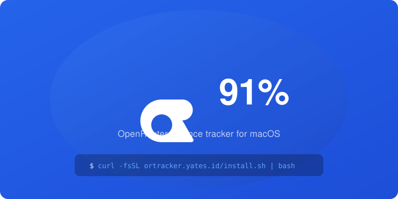

# ORTracker — OpenRouter Balance Tracker

A native macOS menu bar app that shows your OpenRouter balance at a glance. Live balance, automatic top-up detection, one-command install.

<p align="center">
  
</p>

## Install

```bash
curl -fsSL https://ortracker.yates.id/install.sh | bash
```

Or download from [Releases](https://github.com/mikeyates/ortracker/releases/latest).

Requires macOS 13+ and an [OpenRouter API key](https://openrouter.ai/keys).

## Features

**Live balance** — Your real OpenRouter balance in the menu bar, updated every 60 seconds. No setup, no servers, no tracking.

**Color bar** — A slim colored bar shows your remaining balance at a glance:
- Green: 50%+ remaining
- Orange: 25–50% remaining  
- Red: less than 25% remaining — time to top up

**Top-up detection** — When you top up your OpenRouter account, the tracker automatically detects the increase and resets to 100%. The bar fills proportionally against your post-top-up balance.

**Privacy first** — Your API key stays on your machine. The app calls OpenRouter directly — no third party, no analytics, no telemetry.

## How it works

The app fetches your balance from OpenRouter's [credits API](https://openrouter.ai/docs/api-reference/credits) every 60 seconds. It stores a baseline (your balance after the last top-up) locally in `~/.ortracker/tracker.json`. When the balance jumps by more than $0.50, it registers as a top-up and the bar resets to 100%.

Your API key is stored in `~/.ortracker/config` (restricted to 600 permissions, readable only by you).

## Menu

| Item | Action |
|---|---|
| Balance & percentage | Your current balance and remaining % |
| Set API Key | Change your OpenRouter API key |
| Refresh Now | Force a balance refresh |
| Quit | Exit the app |

## Uninstall

```bash
rm -rf /Applications/ORTracker.app ~/.ortracker
```

## Development

```bash
# Clone
git clone https://github.com/mikeyates/ortracker.git
cd ortracker

# Compile
swiftc -O ORTracker.swift -o ORTracker

# Run (after setting up API key)
./ORTracker
```

## Security

Your OpenRouter API key is stored on your machine at `~/.ortracker/config` with 600 file permissions (owner read/write only — no other user or process can read it without root). The app loads it only when making the balance request.

The app sends a single HTTPS request to `openrouter.ai/api/v1/credits` with your key as a Bearer token. The same as every API call your browser or CLI tools make to OpenRouter. The connection is encrypted (TLS), and no telemetry, analytics, or logs leave your machine.

## Why?

OpenRouter doesn't show your balance in the menu bar. ORTracker fixes that — no browser tab, no dashboard, just the number.

Built with Swift, runs on macOS 13+. Open source under the MIT license.